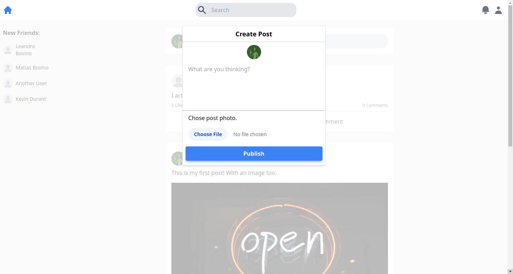

## Facebook clone!

This page is a FullStack Facebook "clone". It was developed using a mobile first approach. You can see it [here](https://odinbook-top.herokuapp.com/).

## How it looks

Homepage

Timeline page

Create post modal

## Built using 
* React
* Redux Toolkit
* Tailwind
* MongoDB
* NodeJs (Express)

## From The Odin Project's [curriculum](https://www.theodinproject.com/lessons/nodejs-odin-book)
